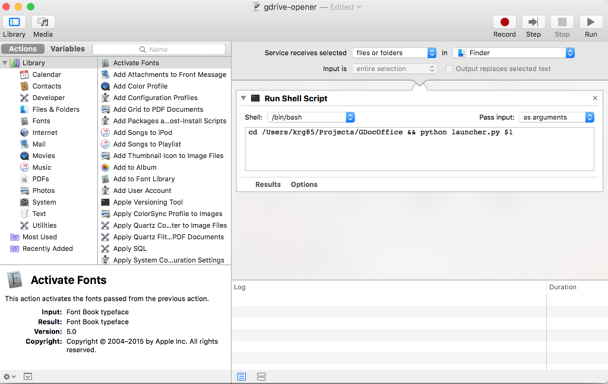

# GDocOffice
A desktop application that allows you to open google docs supported files in proper google docs application by clicking on it or from command line

## Installation

```
git clone git@github.com:kgritesh/GDocOffice.git
cd GDocOffice
pip install -r requirements.txt
```

## Command Line
```
python launcher.py <filename>
```

## Mac (Right Click Menu)

* Open Automator

* Create a new Service

* Set the top two drop downs across the top to "Service receives selected files or folders in Finder.app"

* Set Pass input to as arguments

* Write your script 

```
cd <GDocOffice Folder>
python launcher.py $1
```

* Save and choose the service name (GDocOffice)


Your Automator window should look like the this: 



**Now you can right click on any supported file format and select GDocOffice and the application will upload the file to Google Drive and open it in the correct google doc application in a new tab.
**